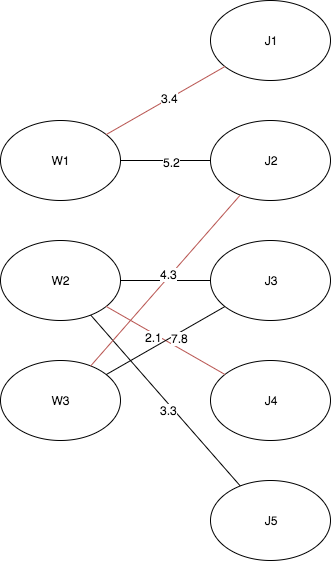

## Simulated annealing for weighted directed graph assignment problem

### Problem statement
The assignment problem is commonly explained with an example -
as a problem of finding optimal allocation of $n$ workers over $m$ jobs.
Two different workers cannot be allocated over the same job and one worker cannot be do more than one job.
Each assignment of a worker to a job has defined its cost / profit $c$.
The goal of the task is to minimize the total cost or maximize the total profit $U$.
Depending on the cardinality of both sets, different models can be considered:

* if no. of workers exceeds no. of jobs: $n \ge m$
    - $U(x) = \sum_{i=1}^{m}\sum_{j=1}^{n}c_{ij}x_{ij} \to min|max$
    - $\sum_{i=1}^{n}x_{ij} = 1, i = 1,2,...m$
    - $\sum_{i=1}^{m}x_{ij} \le 1, j = 1,2...n$
    - $x_{ij} \in \{1, 2\}, i = 1,2...n, j = 1,2...m$
* if n < m - no. of workers is under no. of jobs
    - $U(x) = \sum_{i=1}^{m}\sum_{j=1}^{n}c_{ij}x_{ij} \to min|max$
    - $\sum_{i=1}^{n}x_{ij} \le 1, i = 1,2,...m$
    - $\sum_{i=1}^{m}x_{ij} = 1, j = 1,2...n$
    - $x_{ij} \in \{1, 2\}, i = 1,2...n, j = 1,2...m$

The problem can be presented graphically as follows:

### Goals
* Design and implement a program solving simulated anneling algorithm,
* Test various temperature ranges,
* Test different temperature cooling schedules:
    * exponential: $T(t) = T_0 * a ^ t$
    * linear: $T(t) = T_0 + a * t$
    * logarithmic: $T(t) = c / log(t + d)$
* Test graphs of different sizes and structures $n \gt m$, $n = m$, $n \lt m$,
* Visualize learning performance.

### Solution concept
#### Assumptions
* Edge costs are held in two dimensional table, where the first dimension denotes vertex indices from bipartite graph part with lower cardinality (*LP*) and the second indices from part of higher cardinality (*HP*).
* The graph is a complete bipartite one. Edges missing in input file are replaced with $+inf$ weights (for minimization problem, $-inf$ weights in case of maximization).
* $x$ is represented by a permutation of vertex indices $\in HP$:

        Let:          |LP| = 4, |HP| = 6

        Solution:     [ 1 4 2 5 ]
        Remaining:    { 3, 6 }
* Neighbour $x$ is computed by choosing a random index from solution $\in HP$ and replacing it by other random index $\in HP$. No matter if it is in the solution or in the remaining set.

#### Algorithm
1. $t = t_{max}$ 
   choose random $x_{current}$
2. choose $x_{next}$ from $x_{current}$ neighbourhood 
   if $U(x_{next})$ is better than $U(x_{current})$ than $x_{current}:=x_{next}$ 
   else if $rand(0,1) > e^{-\delta U/t}$ than $x_{current}:=x_{next}$ 
   repeat step 2. $k_t$ times
3. t = T(t) 
   if $t \gt t_{min}$ then goto step 2. 
   else goto step 1.

### References
* http://www.fys.ku.dk/~andresen/BAhome/ownpapers/permanents/annealSched.pdf
* http://zzsw.zut.edu.pl/download/AB/5%20problemy%20przydzialu.pdf
* http://www.mini.pw.edu.pl/~januszwa/zad5.pdf
